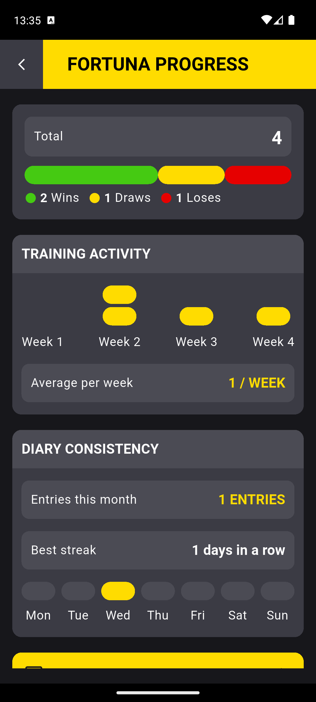
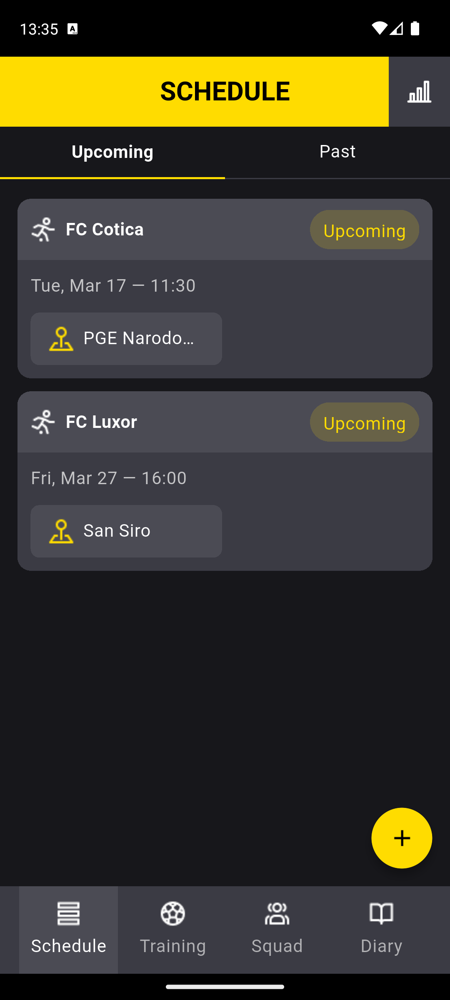
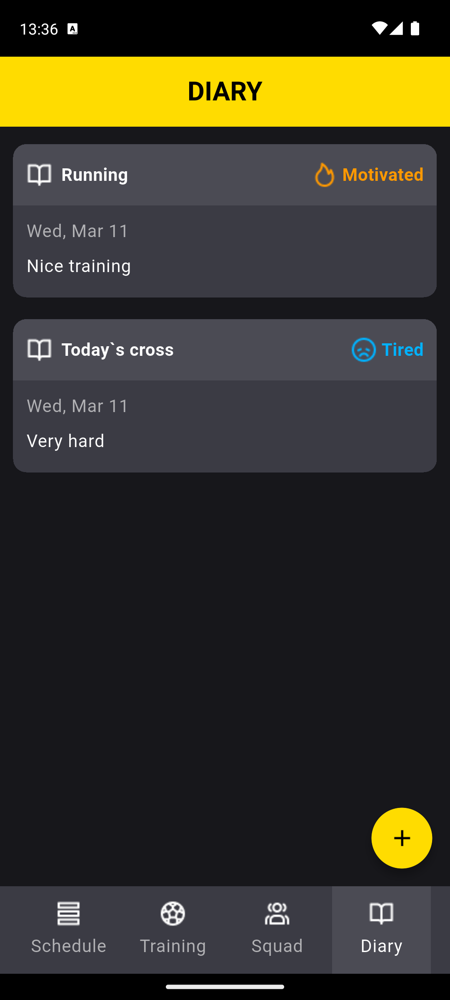

##Fortuna football club
Elevate your football game with automated scheduling and data-driven performance insights. Manage your team's matches and training in one place.

## ✨ Key Features
* **Event Planning:** Schedule and manage upcoming matches and training sessions with ease.
* **Performance Tracking:** Monitor individual and team metrics to stay on top of your game.
* **Activity Logs:** Keep a detailed history of all training activities and match results.
* **Personalized Dashboard:** A central hub for players to see their upcoming schedule and recent progress.

## 📸 Screenshots

  
  
  

